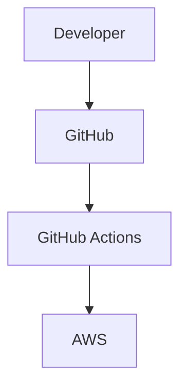

# Cloud & DevOps Knowledge Base

## Project Overview

A modern developer-focused documentation platform built with **Next.js 15**, **TypeScript**, **Tailwind CSS v4**, and **MDX**.

The platform serves as a personal knowledge base for publishing:

* AWS Documentation
* DevOps Guides
* Linux Tutorials
* Docker Documentation
* Kubernetes Runbooks
* Terraform Modules
* CI/CD Pipelines
* Networking Guides
* Cloud Architecture Patterns
* System Administration Notes
* Security Documentation
* Future Technical Content

The user experience should combine the best aspects of:

* GitBook
* Docusaurus
* Vercel Docs
* Hashnode Docs
* Linear

---

# Goals

## Primary Goals

* Fast static documentation website
* Excellent developer experience
* SEO optimized
* Git-based content management
* Scalable architecture
* Simple content publishing workflow
* Production-ready deployment on Vercel

---

# Tech Stack

## Frontend

* Next.js 15 App Router
* TypeScript
* React 19
* Tailwind CSS v4
* shadcn/ui
* Lucide React

## Content

* MDX
* Contentlayer (or Velite)
* Gray Matter
* Reading Time

## Search

* Pagefind
* Fuse.js (fallback)

## Syntax Highlighting

* Shiki

## Diagrams

* Mermaid
* React Mermaid Renderer

## SEO

* next-sitemap
* JSON-LD
* Open Graph
* Metadata API

## Analytics

* Plausible Analytics
* Umami Analytics

## Deployment

* Vercel
* GitHub Actions

---

# Content Architecture

## Content Directory

```text
content/
│
├── aws/
├── devops/
├── linux/
├── docker/
├── kubernetes/
├── terraform/
├── cicd/
├── networking/
├── cloud/
├── security/
├── sysadmin/
├── templates/
└── misc/
```

---

# MDX Frontmatter

Every document must support:

```yaml
title:
description:
slug:
category:
tags:
publishedAt:
updatedAt:
featured:
author:
readingTime:
coverImage:
```

Example:

```yaml
---
title: AWS EC2 Complete Setup Guide
description: Step-by-step EC2 deployment guide
slug: aws-ec2-complete-setup
category: aws
tags:
  - ec2
  - aws
  - cloud
publishedAt: 2026-01-01
updatedAt: 2026-01-05
featured: true
author: Satveek Gupta
readingTime: 12
coverImage: /images/aws-ec2-cover.png
---
```

---

# Folder Structure

```text
src/
│
├── app/
│   ├── page.tsx
│   ├── docs/
│   │   └── [...slug]/
│   │       └── page.tsx
│   │
│   ├── category/
│   │   └── [category]/
│   │
│   ├── tag/
│   │   └── [tag]/
│   │
│   ├── search/
│   ├── rss.xml/
│   ├── sitemap.xml/
│   └── robots.txt/
│
├── components/
│   ├── docs/
│   ├── search/
│   ├── toc/
│   ├── layout/
│   ├── mdx/
│   ├── ui/
│   └── analytics/
│
├── lib/
│   ├── mdx/
│   ├── content/
│   ├── search/
│   ├── seo/
│   ├── rss/
│   └── utils/
│
├── hooks/
│
├── styles/
│
└── types/
```

---

# Application Routes

## Homepage

```text
/
```

Contains:

* Hero Section
* Featured Articles
* Recent Articles
* Popular Categories
* Tag Cloud
* Search CTA

---

## Documentation

```text
/docs/[...slug]
```

Example:

```text
/docs/aws/ec2-setup
/docs/docker/docker-compose-guide
/docs/kubernetes/deployment-strategies
```

---

## Categories

```text
/category/aws
/category/docker
/category/kubernetes
/category/devops
```

Automatically generated.

---

## Tags

```text
/tag/ec2
/tag/terraform
/tag/eks
```

Automatically generated.

---

# Layout Structure

```text
┌─────────────────────────────────────┐
│ Top Navigation                      │
├────────────┬──────────────┬──────────┤
│ Sidebar    │ Content      │ TOC      │
│ Navigation │ Area         │          │
└────────────┴──────────────┴──────────┘
```

---

# Documentation Features

## Sidebar Navigation

Supports:

* Categories
* Nested pages
* Expand/collapse
* Active page highlighting

---

## Breadcrumbs

Example:

```text
Home > AWS > EC2 > Setup Guide
```

---

## Reading Progress Bar

Shows:

* Current reading position
* Completion percentage

---

## Previous / Next Navigation

Automatically generated from document order.

---

# MDX Components

Supported Components:

```tsx
<Callout />
<CodeBlock />
<Tabs />
<Steps />
<Mermaid />
<YouTube />
<Image />
<ArchitectureDiagram />
```

---

# Search System

## Search Requirements

Search by:

* Title
* Content
* Tags
* Category

---

## Command Menu

Shortcut:

```text
Ctrl + K
Cmd + K
```

Provides:

* Instant search
* Keyboard navigation
* Recent searches

---

# Code Blocks

Requirements:

* Shiki syntax highlighting
* Copy button
* Filename display
* Highlighted lines

Example:

````mdx
```bash title="deploy.sh" {2}
terraform init
terraform apply
```
````

---

# Table of Contents

Generated automatically from:

```md
## Heading
### Subheading
#### Deep Heading
```

Displayed in sticky right sidebar.

---

# SEO Strategy

## Metadata

Generate:

* Title
* Description
* Canonical URL
* Keywords
* Open Graph
* Twitter Card

---

## Structured Data

Use JSON-LD:

* Article Schema
* Breadcrumb Schema
* Website Schema

---

## Sitemap

Automatically generate:

```text
/sitemap.xml
```

---

## Robots

Generate:

```text
/robots.txt
```

---

# RSS Feed

Generate:

```text
/rss.xml
```

Includes:

* Latest Articles
* Categories
* Publish Dates

---

# Analytics

Integrate:

## Plausible

Track:

* Page Views
* Referrers
* Popular Articles

Alternative:

* Umami

---

# Dark Mode

Modes:

* Light
* Dark
* System

Persistence:

```text
localStorage
```

Use:

```bash
next-themes
```

---

# Related Articles Engine

Matching Factors:

1. Same category
2. Shared tags
3. Similar keywords

Display:

```text
Related Articles
```

at the bottom of each document.

---

# Documentation Templates

## Template Types

### AWS EC2 Setup

```text
Overview
Prerequisites
Architecture
Steps
Verification
Troubleshooting
References
```

### S3 Bucket Setup

```text
Overview
Requirements
Implementation
Validation
Cleanup
```

### Terraform Module

```text
Purpose
Variables
Outputs
Example Usage
```

### Kubernetes Deployment

```text
Architecture
Manifest
Deployment
Testing
Rollback
```

### Linux Hardening

```text
Checklist
Commands
Validation
References
```

Templates should display a dedicated badge:

```text
Template
```

---

# Mermaid Support

Example:

````md

````

Render automatically within MDX.

---

# Performance Targets

## Lighthouse

Target:

```text
Performance > 95
Accessibility > 95
SEO > 95
Best Practices > 95
```

---

## Optimization

* Static generation
* Dynamic imports
* Lazy loading
* Optimized images
* Route caching
* Metadata caching

---

# Environment Variables

```env
NEXT_PUBLIC_SITE_URL=
NEXT_PUBLIC_PLAUSIBLE_DOMAIN=
NEXT_PUBLIC_UMAMI_ID=
NEXT_PUBLIC_GITHUB_REPO=
```

---

# Deployment Workflow

## Git Workflow

```text
Write MDX
↓
Commit
↓
Push
↓
GitHub Actions
↓
Vercel Build
↓
Production Deployment
```

---

# GitHub Actions

```yaml
Lint
Type Check
Build
Deploy
```

Pipeline Steps:

1. Install Dependencies
2. Type Check
3. ESLint
4. Build
5. Verify Sitemap
6. Deploy

---

# Homepage Sections

## Hero

Title:

Cloud & DevOps Knowledge Base

Subtitle:

Production-ready guides, templates, and infrastructure documentation.

CTA:

* Browse Documentation
* Search Knowledge Base

---

## Featured Articles

Display:

* Featured Badge
* Reading Time
* Category

---

## Recent Articles

Latest published documents.

---

## Popular Categories

Cards:

* AWS
* Linux
* Docker
* Kubernetes
* Terraform
* DevOps

---

## Tags Cloud

Dynamic tag visualization.

---

# Security Considerations

* Strict CSP
* XSS protection
* Secure headers
* Rate limiting (future)
* Input sanitization

---

# Future Roadmap

## Phase 2

* User accounts
* Bookmarks
* Reading history
* Comments
* Reactions

## Phase 3

* AI documentation assistant
* Semantic search
* RAG-powered documentation chat

## Phase 4

* Multi-author publishing
* Editorial workflow
* Admin dashboard

---

# Success Criteria

The platform should:

* Feel comparable to Vercel Docs
* Scale to 1,000+ articles
* Load instantly
* Be SEO friendly
* Require no database
* Support long-term content growth
* Be maintainable and extensible
* Serve as a professional DevOps knowledge repository

```
```
