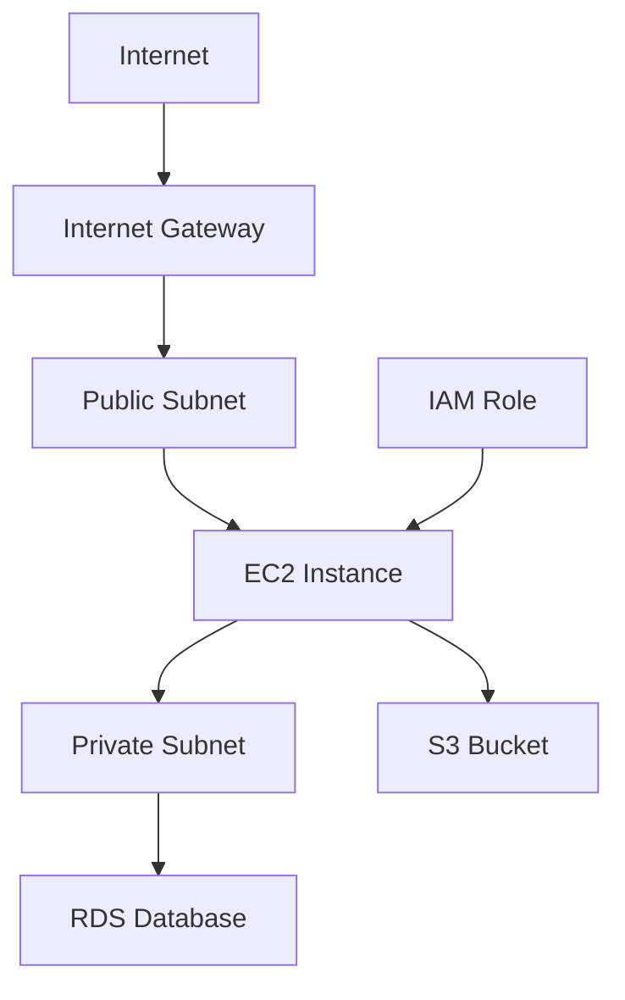

## Overview

Amazon EC2 (Elastic Compute Cloud) is the backbone of AWS compute. This guide walks through everything you need to launch a production-grade EC2 instance — from choosing the right AMI to hardening SSH and attaching IAM roles.

## Prerequisites

- AWS account with IAM admin access
- AWS CLI installed and configured (`aws configure`)
- Basic Linux knowledge

## Architecture



## Step 1 — Create a Key Pair

```bash title="create-key.sh"
aws ec2 create-key-pair \
  --key-name my-key \
  --query 'KeyMaterial' \
  --output text > ~/.ssh/my-key.pem

chmod 400 ~/.ssh/my-key.pem
```

<Callout type="warning">
Never commit your `.pem` file to version control. Add it to `.gitignore` immediately.
</Callout>

## Step 2 — Create a Security Group

```bash title="create-sg.sh"
# Create security group
aws ec2 create-security-group \
  --group-name web-sg \
  --description "Web server security group" \
  --vpc-id vpc-xxxxxxxx

# Allow SSH from your IP only
aws ec2 authorize-security-group-ingress \
  --group-id sg-xxxxxxxx \
  --protocol tcp \
  --port 22 \
  --cidr $(curl -s ifconfig.me)/32

# Allow HTTP and HTTPS
aws ec2 authorize-security-group-ingress \
  --group-id sg-xxxxxxxx \
  --protocol tcp \
  --port 80 \
  --cidr 0.0.0.0/0

aws ec2 authorize-security-group-ingress \
  --group-id sg-xxxxxxxx \
  --protocol tcp \
  --port 443 \
  --cidr 0.0.0.0/0
```

## Step 3 — Launch the Instance

```bash title="launch-ec2.sh" {5,6}
aws ec2 run-instances \
  --image-id ami-0c55b159cbfafe1f0 \
  --count 1 \
  --instance-type t3.micro \
  --key-name my-key \
  --security-group-ids sg-xxxxxxxx \
  --subnet-id subnet-xxxxxxxx \
  --associate-public-ip-address \
  --tag-specifications 'ResourceType=instance,Tags=[{Key=Name,Value=web-server}]'
```

<Callout type="tip">
Use **t3.micro** for development. For production, start with **t3.medium** and right-size after 2 weeks of CloudWatch data.
</Callout>

## Step 4 — Attach an IAM Role

<Steps>
  <Step title="Create the IAM role">
    ```bash
    aws iam create-role \
      --role-name EC2-S3-ReadRole \
      --assume-role-policy-document file://ec2-trust-policy.json
    ```
  </Step>
  <Step title="Attach the policy">
    ```bash
    aws iam attach-role-policy \
      --role-name EC2-S3-ReadRole \
      --policy-arn arn:aws:iam::aws:policy/AmazonS3ReadOnlyAccess
    ```
  </Step>
  <Step title="Create instance profile and attach">
    ```bash
    aws iam create-instance-profile --instance-profile-name EC2-S3-Profile
    aws iam add-role-to-instance-profile \
      --instance-profile-name EC2-S3-Profile \
      --role-name EC2-S3-ReadRole

    aws ec2 associate-iam-instance-profile \
      --instance-id i-xxxxxxxxxxxxxxxxx \
      --iam-instance-profile Name=EC2-S3-Profile
    ```
  </Step>
</Steps>

## Step 5 — SSH and Harden

```bash title="connect.sh"
ssh -i ~/.ssh/my-key.pem ec2-user@<PUBLIC_IP>
```

Once connected, apply hardening:

```bash title="harden.sh"
# Update packages
sudo dnf update -y

# Disable root login
sudo sed -i 's/PermitRootLogin yes/PermitRootLogin no/' /etc/ssh/sshd_config

# Disable password auth (key-only)
sudo sed -i 's/#PasswordAuthentication yes/PasswordAuthentication no/' /etc/ssh/sshd_config

# Restart SSH
sudo systemctl restart sshd

# Enable firewall
sudo systemctl enable --now firewalld
sudo firewall-cmd --permanent --add-service=http
sudo firewall-cmd --permanent --add-service=https
sudo firewall-cmd --reload
```

## Verification

```bash
# Check instance status
aws ec2 describe-instance-status --instance-ids i-xxxxxxxxxxxxxxxxx

# Verify IAM role
aws sts get-caller-identity

# Test S3 access from instance
aws s3 ls
```

## Troubleshooting

| Issue | Cause | Fix |
|-------|-------|-----|
| SSH timeout | Security group missing port 22 | Add inbound rule for TCP 22 |
| Permission denied | Wrong key or user | Use correct `.pem` and AMI username |
| No public IP | Subnet not auto-assigning | Enable auto-assign or use Elastic IP |
| IAM denied | Role not attached | Attach instance profile |

## References

- [AWS EC2 Documentation](https://docs.aws.amazon.com/ec2/)
- [EC2 Instance Types](https://aws.amazon.com/ec2/instance-types/)
- [AWS Security Groups](https://docs.aws.amazon.com/vpc/latest/userguide/VPC_SecurityGroups.html)
