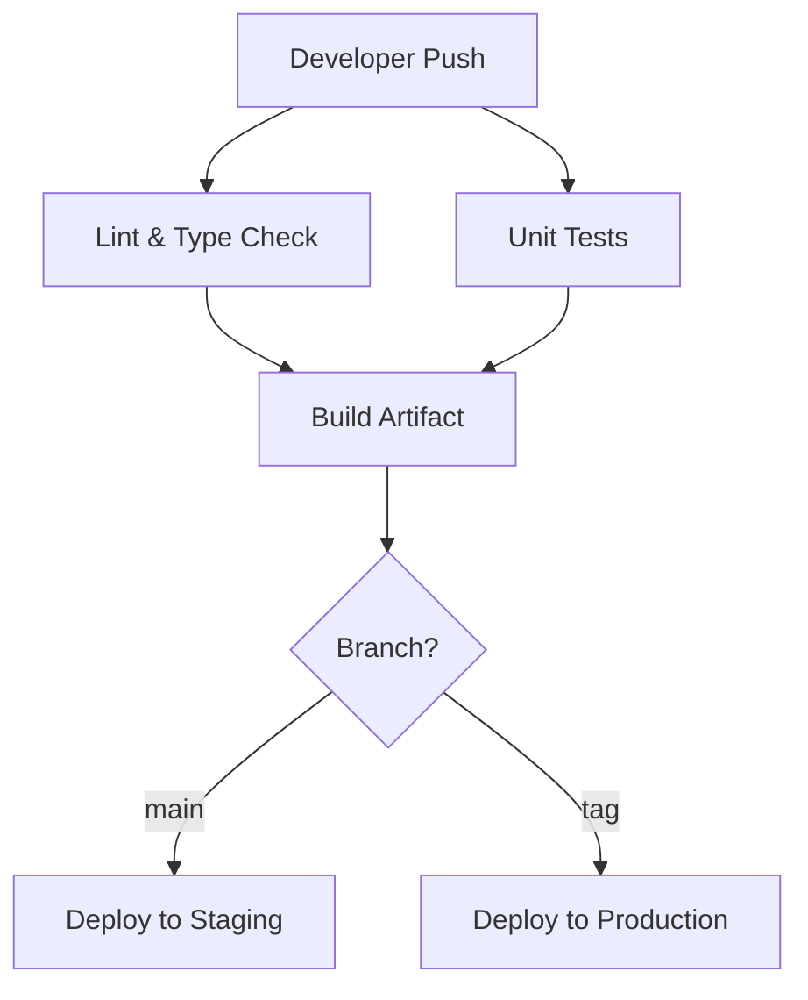

## Overview

This guide details a production-grade CI/CD workflow using GitHub Actions. It features dependency caching, parallel test execution, and secure OIDC-based deployment to AWS.

<Callout type="tip">
Use GitHub OIDC (OpenID Connect) instead of long-lived AWS IAM User Access Keys to authenticate your workflows securely.
</Callout>

## Architecture

This pipeline is divided into three main stages: Lint & Test, Build, and Deploy.



## Workflow Configuration

Create a file at `.github/workflows/pipeline.yml` with the following configuration.

```yaml title=".github/workflows/pipeline.yml"
name: CI/CD Pipeline

on:
  push:
    branches: [ main ]
    tags: [ 'v*.*.*' ]
  pull_request:
    branches: [ main ]

permissions:
  id-token: write # Required for AWS OIDC authentication
  contents: read

jobs:
  validate:
    name: Lint & Test
    runs-on: ubuntu-latest
    steps:
      - name: Checkout Code
        uses: actions/checkout@v4

      - name: Setup Node.js
        uses: actions/setup-node@v4
        with:
          node-size: 20
          cache: 'npm'

      - name: Install Dependencies
        run: npm ci

      - name: Run Linter
        run: npm run lint

      - name: Run Type Check
        run: npm run type-check

      - name: Run Unit Tests
        run: npm run test -- --coverage

  deploy-staging:
    name: Deploy to Staging
    needs: validate
    if: github.ref == 'refs/heads/main' && github.event_name == 'push'
    runs-on: ubuntu-latest
    steps:
      - name: Checkout Code
        uses: actions/checkout@v4

      - name: Configure AWS Credentials
        uses: aws-actions/configure-aws-credentials@v4
        with:
          role-to-assume: arn:aws:iam::123456789012:role/GitHubActionsStagingRole
          aws-region: us-east-1

      - name: Deploy Staging
        run: |
          echo "Deploying application to Staging environment..."
          # Insert AWS CLI or deployment scripts here
```

## Common Commands

Below are standard commands to work with GitHub Actions locally or manage runner environments.

```bash
# Run workflows locally using act
act -j validate

# Install github CLI to check workflow status
gh run list

# View live logs for a running workflow
gh run watch
```

## Best Practices

1. **Avoid Hardcoded Credentials**: Always use repository secrets or secure OIDC federation.
2. **Cache Dependencies**: Enable package caching to reduce pipeline run time by up to 60%.
3. **Use Branch Protection**: Ensure all tests pass in pull requests before allowing merge to `main`.
