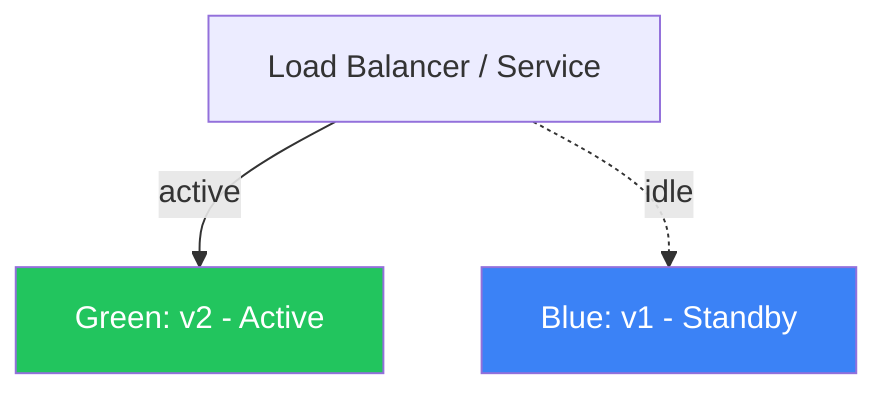

## Overview

Kubernetes provides powerful primitives for zero-downtime deployments. Understanding deployment strategies is essential for maintaining high availability in production.

## Strategy Comparison

| Strategy | Downtime | Risk | Rollback Speed | Resource Cost |
|----------|----------|------|----------------|---------------|
| Recreate | Yes | High | Fast | Low |
| Rolling Update | None | Medium | Medium | Low |
| Blue/Green | None | Low | Instant | 2x |
| Canary | None | Very Low | Instant | Medium |
| A/B Testing | None | Low | Instant | Medium |

## Rolling Update (Default)

```yaml title="rolling-deployment.yaml"
apiVersion: apps/v1
kind: Deployment
metadata:
  name: web-app
  namespace: production
spec:
  replicas: 6
  strategy:
    type: RollingUpdate
    rollingUpdate:
      maxSurge: 2        # Allow 2 extra pods during update
      maxUnavailable: 1  # At most 1 pod down at a time
  selector:
    matchLabels:
      app: web-app
  template:
    metadata:
      labels:
        app: web-app
        version: v2
    spec:
      containers:
        - name: web-app
          image: myapp:v2.1.0
          ports:
            - containerPort: 8080
          readinessProbe:
            httpGet:
              path: /healthz
              port: 8080
            initialDelaySeconds: 10
            periodSeconds: 5
            failureThreshold: 3
          livenessProbe:
            httpGet:
              path: /livez
              port: 8080
            initialDelaySeconds: 30
            periodSeconds: 10
          resources:
            requests:
              memory: "128Mi"
              cpu: "250m"
            limits:
              memory: "256Mi"
              cpu: "500m"
```

<Callout type="warning">
Always define `readinessProbe`. Without it, Kubernetes sends traffic to pods that aren't ready, causing 5xx errors during rollouts.
</Callout>

## Blue/Green Deployment



```yaml title="blue-green.yaml"
# Blue deployment (current production)
apiVersion: apps/v1
kind: Deployment
metadata:
  name: web-app-blue
spec:
  replicas: 3
  selector:
    matchLabels:
      app: web-app
      slot: blue
  template:
    metadata:
      labels:
        app: web-app
        slot: blue
        version: v1
    spec:
      containers:
        - name: web-app
          image: myapp:v1.0.0

---
# Green deployment (new version)
apiVersion: apps/v1
kind: Deployment
metadata:
  name: web-app-green
spec:
  replicas: 3
  selector:
    matchLabels:
      app: web-app
      slot: green
  template:
    metadata:
      labels:
        app: web-app
        slot: green
        version: v2
    spec:
      containers:
        - name: web-app
          image: myapp:v2.0.0

---
# Service — switch between blue/green by changing selector
apiVersion: v1
kind: Service
metadata:
  name: web-app-svc
spec:
  selector:
    app: web-app
    slot: green  # ← Change this to switch traffic
  ports:
    - port: 80
      targetPort: 8080
```

### Switching Traffic

```bash title="switch-traffic.sh"
# Switch to green
kubectl patch service web-app-svc -p '{"spec":{"selector":{"slot":"green"}}}'

# Verify rollout
kubectl get pods -l slot=green

# If issues, instant rollback to blue
kubectl patch service web-app-svc -p '{"spec":{"selector":{"slot":"blue"}}}'
```

## Canary Deployment

<Steps>
  <Step title="Deploy canary with 10% traffic">
    ```bash
    # Deploy canary (1 replica = 10% if main has 9)
    kubectl apply -f canary-deployment.yaml
    ```

    ```yaml title="canary-deployment.yaml"
    apiVersion: apps/v1
    kind: Deployment
    metadata:
      name: web-app-canary
    spec:
      replicas: 1
      selector:
        matchLabels:
          app: web-app
          track: canary
      template:
        metadata:
          labels:
            app: web-app
            track: canary
        spec:
          containers:
            - name: web-app
              image: myapp:v2.0.0-beta
    ```
  </Step>
  <Step title="Monitor metrics for 30 minutes">
    ```bash
    # Watch error rate
    kubectl top pods -l app=web-app
    kubectl logs -l track=canary --tail=100 -f
    ```
  </Step>
  <Step title="Promote to full rollout">
    ```bash
    # If metrics look good, promote
    kubectl set image deployment/web-app-main web-app=myapp:v2.0.0-beta
    kubectl delete deployment web-app-canary
    ```
  </Step>
</Steps>

## Rollback

```bash title="rollback.sh"
# Check rollout history
kubectl rollout history deployment/web-app

# Rollback to previous version
kubectl rollout undo deployment/web-app

# Rollback to specific revision
kubectl rollout undo deployment/web-app --to-revision=3

# Check rollout status
kubectl rollout status deployment/web-app
```

## References

- [Kubernetes Deployments](https://kubernetes.io/docs/concepts/workloads/controllers/deployment/)
- [Zero-Downtime Deployments](https://kubernetes.io/docs/tutorials/kubernetes-basics/update/update-intro/)
