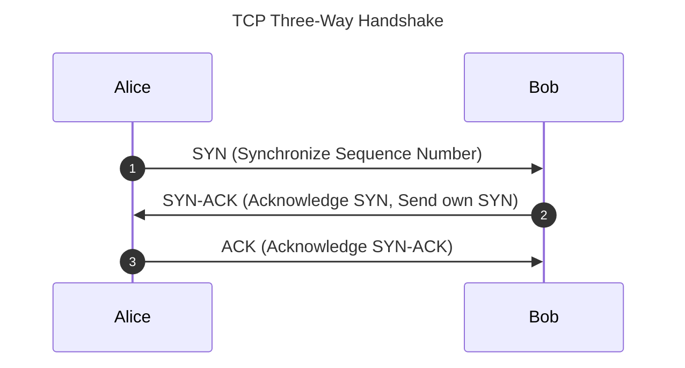
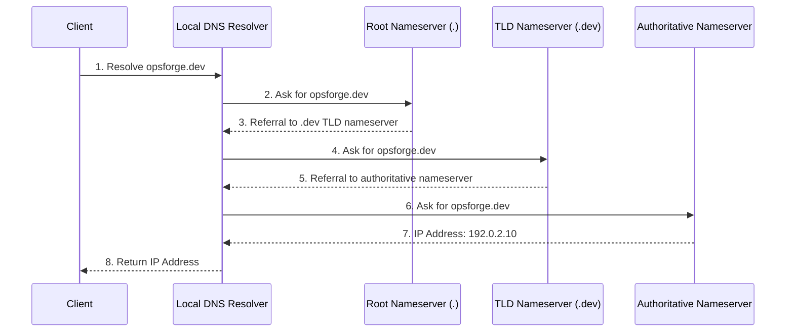
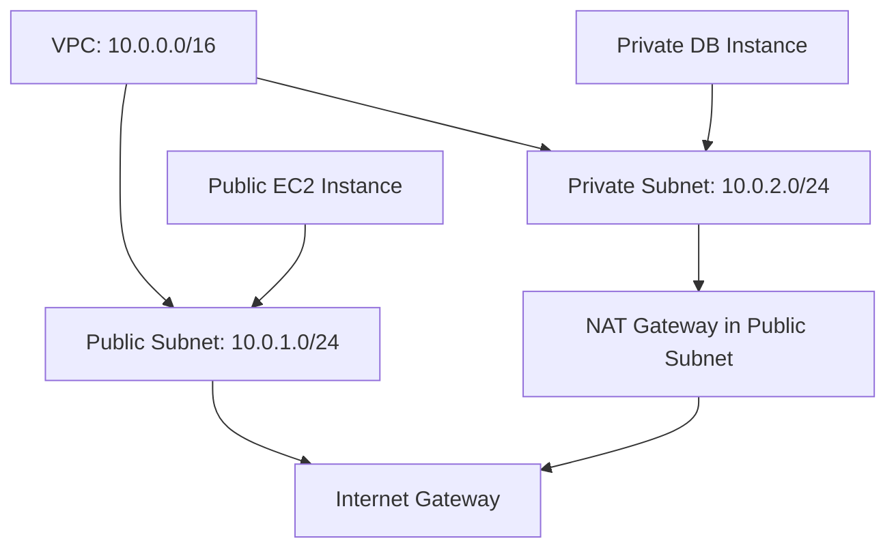

## Overview

Modern cloud architectures, microservices, and containerized environments rely heavily on the underlying network fabric. As a DevOps or Cloud Engineer, you do not just write code; you build, deploy, configure, and troubleshoot systems that must communicate securely and efficiently. Whether diagnosing a failing Kubernetes Service, configuring an AWS VPC, or securing an ingress pipeline, a deep understanding of networking is essential.

This guide provides a comprehensive handbook of networking fundamentals, bridging theoretical models with real-world infrastructure practices.

---

## Prerequisites

Before diving in, you should have:
- A basic understanding of Linux systems and terminal navigation.
- Familiarity with cloud concepts (virtual machines, instances).
- Basic exposure to container environments (Docker, Kubernetes).

---

## Introduction to Networking

### What is Networking?
At its core, computer networking is the practice of connecting multiple computing devices to share resources, exchange files, and facilitate communication. In modern systems, this extends beyond physical hardware to virtual networks, software-defined overlays, and API-driven fabrics.

### Why Networking Matters in DevOps
In a DevOps culture, the boundaries between development, system administration, and network engineering are blurred. Network problems are a primary cause of system outages and performance degradation.
- **Microservices Complexity**: Hundreds of microservices communicating via HTTP/gRPC depend on stable DNS, routing, and load balancing.
- **Infrastructure as Code (IaC)**: Tools like Terraform require cloud architects to declare VPCs, CIDR blocks, subnets, gateways, and firewall rules programmatically.
- **Container Overlay Networks**: Platforms like Kubernetes abstract networking through Container Network Interfaces (CNIs), mapping virtual Pod IPs to physical host networks.

### Networking in Modern Infrastructure
Traditional networking relied on rack-mounted switches, physical firewalls, and manual cabling. Modern cloud infrastructure employs **Software-Defined Networking (SDN)**. SDN separates the control plane (deciding where traffic goes) from the data plane (forwarding the traffic), allowing engineers to spawn virtual networks instantly via API calls.

---

## Network Types

Networks are categorized by geographical scale and operational intent.

| Network Type | Full Name | Scale / Description | Typical DevOps Context |
| :--- | :--- | :--- | :--- |
| **PAN** | Personal Area Network | Centered around a single person (e.g., Bluetooth). | Local workstation setup, wearable testing. |
| **LAN** | Local Area Network | Small geographic area (office, home, data center rack). | Physical bare-metal server provisioning. |
| **MAN** | Metropolitan Area Network | City-wide or regional network (e.g., cable TV). | Fiber links connecting regional corporate campuses. |
| **WAN** | Wide Area Network | Broad geographical area spanning countries or globes. | The public Internet, multi-region cloud backbones. |
| **VPN** | Virtual Private Network | Encrypted tunnel overlaying an untrusted network (WAN). | Secure remote engineer access, site-to-site tunnels. |

### VPN Protocols in DevOps
In modern cloud architectures, Virtual Private Networks are critical for securing administrative traffic. Three primary protocols dominate:
- **IPsec (Internet Protocol Security)**: Heavyweight, highly secure suite operating at the Network layer. Often used for hardware-based site-to-site tunnels connecting on-premises data centers to AWS VPC Virtual Private Gateways.
- **OpenVPN**: Highly configurable SSL/TLS VPN operating at the Transport layer. Widely used for client-to-site access, though it introduces significant CPU overhead.
- **WireGuard**: A modern, lightweight protocol utilizing state-of-the-art cryptography. It runs in Linux kernel-space, offering drastically lower latency and throughput overhead, making it ideal for container-to-container tunneling.

---

## The OSI Model

The **Open Systems Interconnection (OSI) Model** is a conceptual framework that standardizes network communications into seven logical layers.

```mermaid
graph TD
  style L7 fill:#161719,stroke:#00d4ff,stroke-width:2px
  style L6 fill:#161719,stroke:#00d4ff,stroke-width:1px
  style L5 fill:#161719,stroke:#00d4ff,stroke-width:1px
  style L4 fill:#161719,stroke:#ff9900,stroke-width:2px
  style L3 fill:#161719,stroke:#22c55e,stroke-width:2px
  style L2 fill:#161719,stroke:#00d4ff,stroke-width:1px
  style L1 fill:#161719,stroke:#00d4ff,stroke-width:1px

  L7[Layer 7: Application] --> L6[Layer 6: Presentation]
  L6 --> L5[Layer 5: Session]
  L5 --> L4[Layer 4: Transport]
  L4 --> L3[Layer 3: Network]
  L3 --> L2[Layer 2: Data Link]
  L2 --> L1[Layer 1: Physical]
```



### Layer 1: Physical Layer
- **Role**: Transmits raw, unstructured bitstreams over a physical medium.
- **Data Unit (PDU)**: Bit.
- **Protocols/Hardware**: Fiber optics, Ethernet cables (CAT6), Hubs, Repeaters, RJ45.
- **DevOps Context**: Physical server connectivity, link light validation on bare-metal systems.

### Layer 2: Data Link Layer
- **Role**: Provides node-to-node data transfer, framing, and physical addressing (MAC addresses). Resolves collisions on local links.
- **Data Unit (PDU)**: Frame.
- **Protocols/Hardware**: Ethernet (IEEE 802.3), Wi-Fi (802.11), ARP, Layer 2 Switches.
- **DevOps Context**: Resolving IP-to-MAC mapping errors via ARP cache, checking network interface card (NIC) link states.

### Layer 3: Network Layer
- **Role**: Handles path determination, logical addressing (IP addresses), and routing across boundaries.
- **Data Unit (PDU)**: Packet.
- **Protocols/Hardware**: IPv4, IPv6, ICMP, IPsec, Routers, Layer 3 Switches.
- **DevOps Context**: Configuring CIDR blocks, managing routing tables, implementing network access control lists (NACLs).

### Layer 4: Transport Layer
- **Role**: Provides end-to-end reliability, flow control, error recovery, and multiplexing (ports).
- **Data Unit (PDU)**: Segment (TCP) / Datagram (UDP).
- **Protocols**: TCP, UDP.
- **DevOps Context**: Troubleshooting connection timeouts, analyzing TCP socket states (e.g., `ESTABLISHED`, `TIME_WAIT`), testing open ports.

### Layer 5: Session Layer
- **Role**: Establishes, manages, and terminates connections (sessions) between applications.
- **Data Unit (PDU)**: Data.
- **Protocols**: NetBIOS, SOCKS, RPC.
- **DevOps Context**: Troubleshooting persistent database sessions or stateful API gateways.

### Layer 6: Presentation Layer
- **Role**: Translates, encrypts, decrypts, and compresses data, formatting it for application consumption.
- **Data Unit (PDU)**: Data.
- **Protocols**: SSL/TLS, ASCII, JPEG, JSON/XML serialization.
- **DevOps Context**: Managing SSL/TLS certificates, negotiating cipher suites, debugging payload encoding issues.

### Layer 7: Application Layer
- **Role**: Interacts directly with software applications. Provides network services directly to end-users.
- **Data Unit (PDU)**: Data.
- **Protocols**: HTTP, DNS, gRPC, SSH, SMTP, DHCP.
- **DevOps Context**: Configuring reverse proxies (Nginx), designing REST/gRPC API patterns, debugging application code errors (HTTP 5xx).

---

## The TCP/IP Model

The **TCP/IP Model** (Internet Protocol Suite) predates the OSI model and is the practical foundation of the modern Internet. It consolidates functions into four logical layers.

| OSI Layer | TCP/IP Layer | Key Protocols | Data PDU |
| :--- | :--- | :--- | :--- |
| **7. Application**<br/>**6. Presentation**<br/>**5. Session** | **Application** | HTTP, DNS, SSH, gRPC, TLS | Data |
| **4. Transport** | **Transport** | TCP, UDP | Segment / Datagram |
| **3. Network** | **Internet** | IP (IPv4, IPv6), ICMP, ARP | Packet |
| **2. Data Link**<br/>**1. Physical** | **Network Access** | Ethernet, MAC, Wi-Fi | Frame / Bit |

<Callout type="note" title="OSI vs TCP/IP Models">
The OSI model is a rigid, academic standard helpful for understanding separation of concerns. The TCP/IP model is a pragmatic, implementation-focused design that matches how actual operating system kernels implement networking stacks.
</Callout>

---

## IP Addressing

An IP (Internet Protocol) address is a unique numerical label assigned to each device connected to a network.

### IPv4
- **Format**: 32-bit address represented in dotted-decimal format (four octets, e.g., `192.168.1.50`).
- **Address Space**: 2^32 (approx. 4.29 billion) addresses.
- **Exhaustion**: IPv4 addresses are exhausted, necessitating techniques like NAT (Network Address Translation).

### IPv6
- **Format**: 128-bit address represented in hexadecimal format, separated by colons (e.g., `2001:0db8:85a3:0000:0000:8a2e:0370:7334`).
- **Address Space**: 2^128 (approx. 3.4 x 10^38) addresses.
- **Key Features**: Auto-configuration (SLAAC), built-in security (IPsec), and elimination of the need for NAT.

### Public vs. Private IPs
- **Public IP**: Routeable across the global Internet. Assigned by registries (IANA, ARIN).
- **Private IP**: Non-routeable on the public Internet. Reserved for internal networks under **RFC 1918**.

#### RFC 1918 Private Ranges
- **10.0.0.0/8**: Range `10.0.0.0` to `10.255.255.255` (16.7M addresses). Standard choice for large enterprise cloud VPCs.
- **172.16.0.0/12**: Range `172.16.0.0` to `172.31.255.255` (1.04M addresses). Often used by default Docker bridge networks (`172.17.0.0/16`).
- **192.168.0.0/16**: Range `192.168.0.0` to `192.168.255.255` (65,536 addresses). Standard for small home and office LANs.

### Loopback Address
- Used by a host to send packets to itself for local testing.
- **IPv4**: `127.0.0.1` (entire class block `127.0.0.0/8` is reserved).
- **IPv6**: `::1`

### APIPA (Automatic Private IP Addressing)
- Link-local addresses assigned dynamically when a DHCP server is unreachable.
- **IPv4 Range**: `169.254.0.0/16`.
- **APIPA in Cloud**: Cloud providers use the link-local address `169.254.169.254` for **Instance Metadata Services (IMDS)**, allowing virtual instances to retrieve metadata, IAM tokens, and configurations.

---

## Subnetting and CIDR

**Classless Inter-Domain Routing (CIDR)** replaced the old classful networking system, allowing flexible allocation of IP subnets using prefix masking.

### Anatomy of a CIDR Block
A CIDR block is written as `IP/Prefix` (e.g., `10.0.0.0/24`). The prefix specifies how many bits are reserved for the **network portion**, leaving the remaining bits for the **host portion**.

For a `/24` network:
- **Total bits**: 32
- **Network bits**: 24 (represented as subnet mask `255.255.255.0`)
- **Host bits**: $32 - 24 = 8$
- **Total IPs**: $2^8 = 256$ addresses.

### Special Addresses in a Subnet
In standard TCP/IP networking, two IP addresses are reserved in every subnet:
1. **Network Address**: First IP in the block (host bits set to 0). Identifies the subnet.
2. **Broadcast Address**: Last IP in the block (host bits set to 1). Used to send data to all hosts on the subnet.

This yields 2^(32 - prefix) - 2 usable host IPs.

<Callout type="warning" title="AWS Subnet Reservations">
In AWS VPC subnets, **five** IP addresses are reserved, not two. For example, in `10.0.0.0/24`:
- `10.0.0.0`: Network address.
- `10.0.0.1`: VPC Router address.
- `10.0.0.2`: DNS Server (AWS Route 53 resolver).
- `10.0.0.3`: Reserved by AWS for future use.
- `10.0.0.255`: Network broadcast address. (AWS VPCs do not support physical broadcasting, but the address remains reserved).
</Callout>

### Subnet Calculation Tables

| CIDR Prefix | Subnet Mask | Total IPs | Usable IPs (Standard) | Usable IPs (AWS) | Host bits |
| :--- | :--- | :--- | :--- | :--- | :--- |
| **/24** | `255.255.255.0` | 256 | 254 | 251 | 8 bits |
| **/26** | `255.255.255.192` | 64 | 62 | 59 | 6 bits |
| **/27** | `255.255.255.224` | 32 | 30 | 27 | 5 bits |
| **/28** | `255.255.255.240` | 16 | 14 | 11 | 4 bits |

#### Subnet Bounds Examples
Let us compute the boundaries for subnets within the `10.0.0.0` network:

- **10.0.0.0/24**:
  - Network Address: `10.0.0.0`
  - Usable Host Range: `10.0.0.1` to `10.0.0.254`
  - Broadcast Address: `10.0.0.255`

- **10.0.0.0/26**:
  - Network Address: `10.0.0.0`
  - Usable Host Range: `10.0.0.1` to `10.0.0.62`
  - Broadcast Address: `10.0.0.63`

- **10.0.0.64/26** (Next sequential subnet):
  - Network Address: `10.0.0.64`
  - Usable Host Range: `10.0.0.65` to `10.0.0.126`
  - Broadcast Address: `10.0.0.127`

---

## Essential Protocols

The application and transport layers rely on standard protocols to execute operations.

| Protocol | Full Name | Default Port | Transport | Purpose & DevOps Context |
| :--- | :--- | :--- | :--- | :--- |
| **HTTP** | Hypertext Transfer Protocol | 80 | TCP | Plaintext web traffic. Debugging API endpoints. |
| **HTTPS** | HTTP Secure | 443 | TCP | Encrypted (TLS) web traffic. Managing ingress certificates. |
| **DNS** | Domain Name System | 53 | UDP & TCP | Name resolution. Troubleshooting internal service discovery. |
| **DHCP** | Dynamic Host Configuration Protocol | 67 (Server), 68 (Client) | UDP | Dynamically assigns IPs to hosts booting on networks. |
| **FTP** | File Transfer Protocol | 20 (Data), 21 (Control) | TCP | Unencrypted legacy file transfer. |
| **SFTP** | SSH File Transfer Protocol | 22 | TCP | Encrypted file transfer running over SSH tunnels. |
| **SSH** | Secure Shell | 22 | TCP | Secure command-line access to remote servers. |
| **SMTP** | Simple Mail Transfer Protocol | 25 (Standard), 587 (TLS) | TCP | Sending email notifications from alerts and applications. |
| **SNMP** | Simple Network Management Protocol | 161 (Poll), 162 (Trap) | UDP | Querying health data from network switches and routers. |
| **NTP** | Network Time Protocol | 123 | UDP | Synchronizing system clocks to avoid distributed state drift. |
| **ICMP** | Internet Control Message Protocol | N/A (IP protocol 1) | N/A | Diagnostic messages used by commands like `ping`. |
| **ARP** | Address Resolution Protocol | N/A | Network Access | Resolves Network layer IPs into MAC addresses on local links. |

---

## TCP vs. UDP

The Transport layer is dominated by two distinct protocols: **Transmission Control Protocol (TCP)** and **User Datagram Protocol (UDP)**.



### TCP: Connection-Oriented & Reliable
TCP guarantees delivery through a structured handshake, sequencing numbers, windowing, and automatic packet retransmission.
- **Three-Way Handshake**:
  1. Client sends a **SYN** (Synchronize) packet containing a random initial sequence number ($ISN_C$).
  2. Server responds with a **SYN-ACK** packet containing its own sequence number ($ISN_S$) and acknowledges the client's packet ($ACK = ISN_C + 1$).
  3. Client sends an **ACK** packet back to the server ($ACK = ISN_S + 1$). Connection is now established.
- **Flow & Error Control**: Adjusts transmission speeds to avoid overwhelming receiver buffers (sliding window algorithm). Detects lost packets and requests retransmissions.

### UDP: Connectionless & Lightweight
UDP simply sends packets ("datagrams") to the receiver without establishing a connection or verifying receipt.
- **Speed**: No handshake overhead or sequence tracking makes UDP faster and less resource-intensive.
- **Lack of Guarantees**: Does not guarantee packet order or delivery. If packet delivery is critical, validation logic must be built into the application layer.

### Comparison Table

| Attribute | TCP | UDP |
| :--- | :--- | :--- |
| **Connection State** | Connection-oriented (stateful session) | Connectionless (stateless) |
| **Reliability** | Guaranteed delivery (retransmission) | Best-effort (packets can be lost) |
| **Ordering** | Guarantees ordered arrival of packets | Packets can arrive in any order |
| **Flow Control** | Yes | No |
| **Header Size** | 20–60 bytes | 8 bytes |
| **Use Cases** | Web browsers (HTTP), database access, SSH | DNS requests, VoIP, video streaming, NTP |

---

## DNS Deep Dive

The **Domain Name System (DNS)** is the address book of the Internet, translating human-readable hostnames (e.g., `opsforge.dev`) into IP addresses.

### DNS Resolution Process
When a client requests a domain name, a series of recursive lookups occur:



1. **Local DNS Cache**: The client checks its OS cache first. If empty, it queries the configured **Recursive Resolver** (often provided by the ISP, or public resolvers like Google's `8.8.8.8` or Cloudflare's `1.1.1.1`).
2. **Root Nameservers (`.`)**: The resolver queries one of the 13 logical root server clusters. The root server does not know the IP, but returns a referral to the **Top-Level Domain (TLD) Nameservers** (e.g., `.dev`).
3. **TLD Nameservers**: The resolver queries the TLD server, which returns referrals to the specific **Authoritative Nameservers** where the domain registration is maintained.
4. **Authoritative Nameservers**: The resolver queries the authoritative nameservers, which return the actual DNS record (e.g., `192.0.2.10`).
5. **Resolver Response & Caching**: The resolver caches the IP according to its Time-to-Live (TTL) value and returns the IP address to the client.

### Key DNS Record Types
- **A**: Maps a hostname to an IPv4 address.
- **AAAA**: Maps a hostname to an IPv6 address.
- **CNAME**: Canonical Name. Maps one domain name to another (alias).
- **MX**: Mail Exchange. Route emails to designated mail servers.
- **TXT**: Plain text records. Used for verification (e.g., SPF, DKIM, site ownership).
- **NS**: Identifies the authoritative nameservers for a zone.

---

## Routing Fundamentals

Routing is the process of selecting paths across networks to direct packets from source to destination.

### Routers and Gateways
- **Router**: Layer 3 device that inspects the destination IP address of incoming packets and forwards them to the next network hop using a **Routing Table**.
- **Default Gateway**: The designated router IP address used by hosts to forward packets intended for destinations outside their local subnet.

### Static vs. Dynamic Routing
- **Static Routing**: Routes are configured manually by network administrators. It is efficient for small networks but does not adapt to link failures.
- **Dynamic Routing**: Routers use protocols to automatically discover paths, construct routing tables, and adapt to outages.

### Dynamic Routing Protocols
- **OSPF (Open Shortest Path First)**: An Interior Gateway Protocol (IGP) used inside a single organization or system. It uses link-state routing, calculating the shortest path to destinations using Dijkstra's algorithm.
- **BGP (Border Gateway Protocol)**: The Exterior Gateway Protocol (EGP) that connects the Internet. It is a path-vector protocol that routes traffic between different autonomous systems (ASes).

---

## Switching Fundamentals

Switching is the process of forwarding data frames between devices on the same physical Local Area Network (LAN).

### MAC Address and ARP
- **MAC Address**: A 48-bit physical address burned into network interface cards.
- **ARP (Address Resolution Protocol)**: Dynamically maps Layer 3 IP addresses to Layer 2 MAC addresses. When a packet is sent, the host issues an ARP request broadcast asking: *"Who has 10.0.0.5? Tell 10.0.0.1."* The host owning the IP responds with its MAC address, which is then cached.

### VLANs (Virtual Local Area Networks)
VLANs allow network administrators to logically segment a single physical switch into multiple isolated broadcast domains.
- **VLAN Isolation**: Traffic cannot pass directly between different VLANs without a Layer 3 router.
- **Access Ports**: Switch ports configured for a single, specific VLAN. Used for standard end-user devices or server interfaces.
- **Trunk Ports**: Switch ports configured to carry traffic for multiple VLANs simultaneously. The switch appends a 4-byte header tag specified by **IEEE 802.1Q** to identify which frame belongs to which VLAN.

---

## Network Security Basics

Securing the network path is a foundational priority for DevOps and Security engineers.

### Firewalls
Firewalls filter traffic based on security rules.
- **Stateless Firewalls**: Inspect individual packets in isolation (filtering by source/destination IP and port).
- **Stateful Firewalls**: Maintain state tables tracking active TCP sessions, allowing responses to return automatically without requiring explicit inbound rules.

### NAT (Network Address Translation)
NAT translates IP addresses in packet headers while they are in transit through a routing device.
- **SNAT (Source NAT)**: Translates private IPs to a public IP as outbound traffic leaves the network. This allows internal instances to access the Internet securely.
- **DNAT (Destination NAT)**: Translates the destination IP of inbound packets (e.g., routing traffic arriving on port 80 of a public IP to an internal private server).

### ACLs, IDS, and IPS
- **ACLs (Access Control Lists)**: Basic firewall rules applied to network interfaces to drop or permit traffic based on headers.
- **IDS (Intrusion Detection System)**: Monitors traffic passively for signatures of malicious activity, alerting administrators.
- **IPS (Intrusion Prevention System)**: Placed inline in the network path; it detects and actively blocks malicious traffic.

### Zero Trust Networking
Zero Trust is a security framework based on the premise: **"Never trust, always verify."** Traditional networks relied on perimeter security (trusted internal networks vs. untrusted external networks). Zero Trust assumes the network is already compromised, requiring continuous authentication, micro-segmentation, and strict access controls at the application layer.

---

## Cloud Networking (AWS)

In public cloud environments, physical networking is abstracted. Let's analyze how this works in AWS:



### VPC (Virtual Private Cloud)
A VPC is a logically isolated virtual network defined by a CIDR block (e.g., `10.0.0.0/16`) where you deploy cloud resources.

### Subnets
Subnets slice a VPC's CIDR block into smaller ranges:
- **Public Subnet**: Subnet whose route table directs traffic outside the VPC to an **Internet Gateway (IGW)**.
- **Private Subnet**: Subnet whose route table directs outbound Internet traffic to a **NAT Gateway** running inside a public subnet.

### Security Groups vs. Network ACLs (NACLs)

| Attribute | Security Groups | Network ACLs (NACLs) |
| :--- | :--- | :--- |
| **Layer** | Instance / Interface Layer (L4) | Subnet Boundary Layer (L3/L4) |
| **State** | **Stateful** (Outbound response allowed automatically) | **Stateless** (Must write explicit inbound and outbound rules) |
| **Rules** | Allow rules only (default deny) | Allow and Deny rules |
| **Evaluation** | Evaluates all rules before deciding | Evaluates rules sequentially by number |

---

## Kubernetes Networking

Kubernetes has a unique, opinionated networking model that ensures all containers can communicate directly without complex port mapping.

### The IP-per-Pod Model
In Kubernetes, every Pod gets a unique, routable IP address within the cluster network. All containers inside a Pod share the same network namespace (meaning they can communicate on `localhost`).

### Services
Since Pods are ephemeral and their IPs change when recreated, Kubernetes uses **Services** to provide stable endpoints.
- **ClusterIP**: Default Service. Exposes the service on a cluster-internal IP. Accessible only within the cluster.
- **NodePort**: Exposes the service on each Node's IP at a static port (usually in the range `30000-32767`).
- **LoadBalancer**: Provisions a cloud provider's external load balancer (e.g., AWS NLB) to route traffic to NodePorts.
- **Headless**: Returns a list of individual Pod IPs via DNS directly, bypassing kube-proxy load balancing.

### Ingress
An **Ingress** manages external access to services, acting as an application-layer reverse proxy (L7). It handles routing paths (e.g., `/api` vs. `/home`) and terminates SSL/TLS certificates.

### CNI (Container Network Interface)
The CNI is the plugin framework that manages Pod networking. Popular CNIs include:
- **Calico**: Highly performant CNI utilizing BGP to route packets. Supports advanced Network Policies.
- **Flannel**: A simple overlay network using VXLAN encapsulation, ideal for basic clusters.

---

## DevOps Networking Commands

These essential commands are used to diagnose and resolve networking issues on Linux hosts.

### ping
Sends ICMP echo requests to verify host connectivity.
```bash
ping -c 3 google.com
```
*Expected Output:*
```text
PING google.com (142.250.190.46) 56(84) bytes of data.
64 bytes from lga25s79-in-f14.1e100.net (142.250.190.46): icmp_seq=1 ttl=116 time=11.2 ms
64 bytes from lga25s79-in-f14.1e100.net (142.250.190.46): icmp_seq=2 ttl=116 time=10.9 ms
64 bytes from lga25s79-in-f14.1e100.net (142.250.190.46): icmp_seq=3 ttl=116 time=11.1 ms

--- google.com ping statistics ---
3 packets transmitted, 3 received, 0% packet loss, time 2003ms
rtt min/avg/max/mdev = 10.923/11.084/11.231/0.126 ms
```

---

### traceroute
Traces the network hops path to a destination.
```bash
traceroute -I google.com
```
*Expected Output:*
```text
traceroute to google.com (142.250.190.46), 30 hops max, 60 byte packets
 1  gateway (192.168.1.1)  0.921 ms  0.881 ms  0.812 ms
 2  10.10.10.1 (10.10.10.1)  4.351 ms  4.212 ms  4.110 ms
 3  142.250.190.46 (142.250.190.46)  11.450 ms  11.231 ms  11.120 ms
```

---

### dig
A DNS lookup utility.
```bash
dig +noall +answer opsforge.dev A
```
*Expected Output:*
```text
opsforge.dev.		300	IN	A	192.0.2.10
```

---

### nslookup
Simple DNS query tool.
```bash
nslookup opsforge.dev
```
*Expected Output:*
```text
Server:		127.0.0.53
Address:	127.0.0.53#53

Non-authoritative answer:
Name:	opsforge.dev
Address: 192.0.2.10
```

---

### curl
Transfers data from or to a server using supported protocols.
```bash
curl -Iv https://opsforge.dev
```
*Expected Output:*
```text
*   Trying 192.0.2.10:443...
* Connected to opsforge.dev (192.0.2.10) port 443
* ALPN: offers h2,http/1.1
* TLSv1.3 (OUT), TLS handshake, Client hello (1):
* TLSv1.3 (IN), TLS handshake, Server hello (2):
* TLSv1.3 (IN), TLS handshake, Encrypted Extensions (8):
* TLSv1.3 (IN), TLS handshake, Certificate (11):
* TLSv1.3 (IN), TLS handshake, Certificate Status (22):
* TLSv1.3 (IN), TLS handshake, Finished (20):
* SSL connection using TLSv1.3 / AEAD-AES256-GCM-SHA384
> HEAD / HTTP/2
> Host: opsforge.dev
> User-Agent: curl/8.5.0
> 
< HTTP/2 200 
< date: Wed, 10 Jun 2026 18:00:00 GMT
< content-type: text/html
< content-length: 4210
< server: cloudflare
```

---

### telnet
Tests TCP connectivity on a specific port.
```bash
telnet 192.0.2.10 443
```
*Expected Output:*
```text
Trying 192.0.2.10...
Connected to 192.0.2.10.
Escape character is '^]'.
```

---

### ss / netstat
Displays active socket connections.
```bash
ss -tulpn
```
*Expected Output:*
```text
Netid State  Recv-Q Send-Q   Local Address:Port   Peer Address:Port Process                                          
udp   UNCONN 0      0        127.0.0.53%lo:53          0.0.0.0:*     users:(("systemd-resolve",pid=842,fd=12))        
tcp   LISTEN 0      4096           0.0.0.0:80          0.0.0.0:*     users:(("nginx",pid=1214,fd=6))                  
tcp   LISTEN 0      128            0.0.0.0:22          0.0.0.0:*     users:(("sshd",pid=912,fd=3))                    
```

---

### ip / ifconfig
Displays interface addresses.
```bash
ip -4 addr show eth0
```
*Expected Output:*
```text
2: eth0: <BROADCAST,MULTICAST,UP,LOWER_UP> mtu 1500 qdisc mq state UP group default qlen 1000
    inet 10.0.1.15/24 brd 10.0.1.255 scope global dynamic eth0
       valid_lft 86312sec preferred_lft 86312sec
```

---

### arp
Displays the local Layer 2 ARP cache table.
```bash
arp -n
```
*Expected Output:*
```text
Address                  HWtype  HWaddress           Flags Mask            Iface
10.0.1.1                 ether   52:54:00:12:34:56   C                     eth0
10.0.1.25                ether   52:54:00:98:76:54   C                     eth0
```

---

### tcpdump
A packet analyzer.
Capture 5 packets on interface `eth0` arriving on port 80:
```bash
sudo tcpdump -i eth0 port 80 -c 5 -nn
```
*Expected Output:*
```text
18:15:32.412105 IP 192.168.1.50.51234 > 10.0.1.15.80: Flags [S], seq 3241293041, win 64240, options [mss 1460]
18:15:32.412351 IP 10.0.1.15.80 > 192.168.1.50.51234: Flags [S.], seq 412093412, ack 3241293042, win 65160
18:15:32.423101 IP 192.168.1.50.51234 > 10.0.1.15.80: Flags [.], ack 1, win 502
18:15:32.424501 IP 192.168.1.50.51234 > 10.0.1.15.80: Flags [P.], seq 1:120, ack 1, win 502
18:15:32.424610 IP 10.0.1.15.80 > 192.168.1.50.51234: Flags [.], ack 120, win 501
```

---

## Troubleshooting Guide

Follow these structured workflows to diagnose common networking failures.

### Scenario A: Website / Endpoint is Not Accessible
```text
[Client] ---> ( Internet ) ---> [ Firewall ] ---> [ Load Balancer ] ---> [ App Server ]
```
1. **Rule out local client issues**: Test resolution and routing locally.
2. **Ping target domain**: Verify if the server responds to ICMP requests. (Note: Many modern CDNs and firewalls block ICMP).
3. **Verify DNS resolution**: Run `dig website.com A`. If no A record is returned, proceed to the DNS troubleshooting workflow.
4. **Test TCP handshake**: Run `nc -zv website.com 443` or `telnet website.com 443`.
   - If connection hangs: Indicates a firewall blocking port 443 (e.g., Security Group, NACL, physical firewall).
   - If connection is refused (`Connection refused`): Indicates the port is open on the network, but no application process (like Nginx) is listening.
5. **Inspect path routing**: Run `traceroute -T -p 443 website.com` to identify the network hop causing packet drops.

### Scenario B: DNS Resolution Failures
1. **Identify configured resolver**: Inspect `/etc/resolv.conf` to check current DNS nameservers.
2. **Query nameservers directly**:
   - Query local resolver: `dig @127.0.0.53 website.com`
   - Query public resolver: `dig @8.8.8.8 website.com`
3. **Compare results**:
   - If public queries work but local queries fail, your local DNS resolver is down or misconfigured.
   - If both fail, verify internet connectivity.
4. **Check DNS zone updates**: Query authoritative NS records: `dig website.com NS`.

### Scenario C: High Latency and Packet Loss
1. **Identify the root host**: Run `mtr -c 50 website.com` (My Traceroute). This merges ping and traceroute diagnostics.
2. **Analyze latency spike locations**:
   - Look at packet loss and jitter columns.
   - If loss begins at hop 2 or 3, it is an ISP issue.
   - If loss occurs only at the final destination, the target instance is experiencing high CPU saturation or network interface queue throttling.
3. **Check local interfaces**: Run `netstat -i` or `ip -s link` to check for drops (`RX-DRP`, `TX-DRP`) or CRC alignment errors indicating physical duplex mismatches.

### Scenario D: SSH Connection Failures
```text
Command: ssh -i key.pem user@192.0.2.50
Error: "ssh: connect to host 192.0.2.50 port 22: Connection timed out"
```
1. **Check basic reachability**: Ping the target IP.
2. **Scan SSH port**: Run `nc -zv 192.0.2.50 22`.
   - If `Timeout`:
     - **Cloud Check**: Inspect the cloud instance security group rules to ensure your IP is explicitly allowed on port 22.
     - **System Check**: Check the local system firewall (e.g., `ufw status` or `firewall-cmd`).
   - If `Connection refused`:
     - The network path is open, but the SSH daemon is not running.
     - **Fix**: Connect via serial console to run `sudo systemctl start sshd`.

### Scenario E: Kubernetes Service Communication Issues
1. **Verify Pod IP connectivity**:
   - Exec into a troubleshooting Pod: `kubectl exec -it debug-pod -- bin/sh`
   - Ping target Pod IP directly: `ping <pod-ip>`. If it fails, the CNI network overlay is broken.
2. **Verify Service IP (ClusterIP)**:
   - Run `curl -Iv <service-ip>:<port>`. If it works, kube-proxy iptables/IPVS rules are routing correctly.
3. **Verify Service endpoints**:
   - Check endpoints: `kubectl get endpoints <service-name>`.
   - If empty: The Service selector labels do not match Pod labels.
4. **Verify CoreDNS resolution**:
   - Query: `nslookup <service-name>.<namespace>.svc.cluster.local`.
   - If resolution fails, inspect CoreDNS pods: `kubectl get pods -n kube-system -l k8s-app=kube-dns`.

---

## Interview Questions and Answers

### Beginner Level (1–25)

#### 1. What is the difference between a Hub, a Switch, and a Router?
A hub broadcasts data to all ports regardless of destination (Layer 1). A switch forwards frames selectively based on MAC addresses (Layer 2). A router forwards packets across networks based on IP addresses (Layer 3).

#### 2. What is a MAC address?
A Media Access Control address is a unique, physical hardware identifier burned into a network interface card at the factory.

#### 3. What is the purpose of a Subnet Mask?
A subnet mask divides an IP address into its network portion and host portion.

#### 4. What is DHCP?
Dynamic Host Configuration Protocol automatically assigns IP addresses, subnet masks, default gateways, and DNS servers to client devices booting on a network.

#### 5. What is the default port for DNS?
Port 53, using UDP for standard queries and TCP for zone transfers or large payloads.

#### 6. What does a "Ping" command do?
It sends an ICMP Echo Request packet to a target IP and listens for an ICMP Echo Reply to verify basic network connectivity.

#### 7. What is NAT?
Network Address Translation modifies IP headers to translate private IPs to public IPs (and vice versa) during transit.

#### 8. What is the default loopback address in IPv4?
`127.0.0.1`

#### 9. What is the difference between Public and Private IP addresses?
Public IPs are unique and routable globally. Private IPs are reserved for internal networks and are not routable.

#### 10. What are the private IP ranges defined by RFC 1918?
`10.0.0.0/8`, `172.16.0.0/12`, and `192.168.0.0/16`.

#### 11. What is the role of ARP?
Address Resolution Protocol resolves Layer 3 IP addresses into Layer 2 MAC addresses on local links.

#### 12. Which OSI layer handles routing?
Layer 3 (Network Layer).

#### 13. What is port number 22 used for?
SSH (Secure Shell) and SFTP.

#### 14. What is a Default Gateway?
The IP address of the local router that a client uses to forward packets destined for outside networks.

#### 15. What are ports 80 and 443 used for?
Port 80 is used for HTTP (plaintext web traffic), and port 443 is used for HTTPS (SSL/TLS encrypted web traffic).

#### 16. What is the difference between IPv4 and IPv6 address lengths?
IPv4 uses 32-bit addresses (dotted-decimal), while IPv6 uses 128-bit addresses (hexadecimal).

#### 17. What is a VLAN?
A Virtual Local Area Network segments a single physical switch into multiple isolated logical broadcast domains.

#### 18. What is the difference between a broadcast and a unicast packet?
Broadcast sends packets to all hosts on a subnet, whereas unicast sends packets to a single specific host.

#### 19. What is a CNAME record?
A Canonical Name record maps an alias domain name to another domain name.

#### 20. What is an MX record?
A Mail Exchange record specifies the mail servers responsible for receiving email on behalf of a domain.

#### 21. What is the role of Layer 4 in the OSI model?
The Transport Layer handles end-to-end communication reliability, flow control, and port multiplexing.

#### 22. What does NTP do?
Network Time Protocol synchronizes the clocks of computers across a network.

#### 23. What is the default port for SMTP?
Port 25.

#### 24. What is a loopback interface?
A virtual network interface used by a computer to test its own local TCP/IP network stack.

#### 25. What is the purpose of an ICMP redirect message?
It is used by routers to notify hosts that a more optimal route is available for a destination.

---

### Intermediate Level (26–50)

#### 26. Explain the TCP Three-Way Handshake.
Client sends SYN; Server responds with SYN-ACK; Client sends ACK. The connection is then established.

#### 27. What is the difference between TCP and UDP?
TCP is connection-oriented, reliable, and ordered but slower due to handshake overhead. UDP is connectionless, fast, and lightweight but does not guarantee delivery.

#### 28. What is a CIDR block?
Classless Inter-Domain Routing is a method for allocating IP addresses and routing IP packets based on prefix lengths (e.g., `/24`).

#### 29. How many usable host IPs are in a `/28` subnet?
2^(32 - 28) - 2 = 16 - 2 = 14 usable host IPs.

#### 30. How does a DNS Recursive Resolver differ from an Authoritative Nameserver?
A recursive resolver searches the Internet hierarchy to find DNS records on behalf of a client. An authoritative nameserver holds the actual DNS records for a domain.

#### 31. What is a Stateful Firewall?
A stateful firewall monitors the state of active network connections, allowing returning traffic for established sessions without needing explicit incoming rules.

#### 32. What is a NAT Gateway, and why is it used?
A NAT Gateway is deployed in a public subnet to allow instances in private subnets to send outbound traffic to the Internet while blocking inbound connections.

#### 33. What is an APIPA address?
An Automatic Private IP address in the `169.254.0.0/16` range, self-assigned by a host when a DHCP server is unreachable.

#### 34. What is the difference between a Trunk Port and an Access Port?
An Access port carries traffic for only one VLAN. A Trunk port carries traffic for multiple VLANs, tagging frames using the 802.1Q standard.

#### 35. What is the purpose of the `traceroute` command?
It identifies the path packets take to a host by sending packets with incrementing Time-to-Live (TTL) values, listening for ICMP time-exceeded messages.

#### 36. What is DNS caching, and why is TTL important?
DNS caching stores resolved queries locally. Time-to-Live (TTL) specifies how long a DNS record should be kept in cache before querying authoritative servers again.

#### 37. What is the difference between SNAT and DNAT?
SNAT changes the source IP of outgoing packets (used for internal hosts accessing the Internet). DNAT changes the destination IP of incoming packets (used to expose internal servers).

#### 38. What is BGP (Border Gateway Protocol)?
The protocol used to route traffic across the Internet by exchanging routing path information between Autonomous Systems.

#### 39. What is a proxy server, and how does a reverse proxy differ?
A forward proxy represents clients requesting resources from servers. A reverse proxy represents servers, receiving client requests and routing them to backend servers.

#### 40. Explain the role of the MTU (Maximum Transmission Unit).
MTU is the largest packet size (in bytes) that can be sent over a physical network medium (default is 1500 bytes).

#### 41. What is TCP congestion control?
An algorithm that prevents sender congestion by dynamically adjusting the congestion window size based on packet loss and latency.

#### 42. Explain the purpose of a CNI in Kubernetes.
The Container Network Interface (CNI) allocates IPs and manages networking connectivity for Pods across nodes.

#### 43. What is a VIP (Virtual IP)?
An IP address not bound to a physical network interface, used to route traffic to active hosts for load balancing and high availability.

#### 44. What is a security group, and is it stateful or stateless?
A virtual host-level firewall in cloud networks; it is stateful.

#### 45. Explain how SSL/TLS encryption works at the transport layer.
A client and server perform a TLS handshake to negotiate cipher suites, verify server certificates, and generate symmetric session keys for encrypted data transfer.

#### 46. What is an Anycast IP?
An IP address assigned to multiple physical servers globally. Packets are routed to the topologically closest server.

#### 47. Explain the function of keep-alive packets in TCP.
Periodically sent empty segments that verify if a connection is still active when no data has been transmitted.

#### 48. What is a broadcast storm, and how is it prevented?
A network failure where broadcast frames loop indefinitely. Prevented using Spanning Tree Protocol (STP) on switches.

#### 49. What is the difference between HTTP/1.1 and HTTP/2?
HTTP/2 supports multiplexing multiple requests over a single TCP connection, uses header compression, and allows server push, improving performance over HTTP/1.1.

#### 50. How does a load balancer handle session persistence?
Using sticky sessions (cookies or source IP hashing) to route subsequent client requests to the same backend server.

---

### Advanced DevOps & Cloud Level (51–75)

#### 51. How does Pod-to-Pod communication work across nodes in Kubernetes?
Using CNI plugins. Overlay networks (e.g., VXLAN/Geneve) encapsulate Pod traffic inside host packets, routing them across node networks. Route-reflector CNIs (e.g., Calico) route packets directly using BGP without encapsulation.

#### 52. Explain Security Groups vs Network ACLs in AWS.
Security Groups are stateful host-level firewalls. NACLs are stateless subnet-level firewalls that require explicit inbound and outbound rules.

#### 53. What happens when you run a DNS query inside a Kubernetes Pod?
The query goes to the cluster's internal DNS service (CoreDNS). If the domain ends in `.cluster.local`, CoreDNS resolves it. If it is external, CoreDNS forwards the request to the node's configured DNS resolver.

#### 54. Explain Zero Trust network design in cloud architectures.
Eliminates implicit trust. Requires mTLS for service communication, micro-segmentation, and strict runtime policies instead of trusting internal networks.

#### 55. What is the difference between a Kubernetes ClusterIP Service and a Headless Service?
A ClusterIP service load-balances traffic through a single Virtual IP. A Headless service (`clusterIP: None`) bypasses the proxy IP, returning a list of backing Pod IPs directly.

#### 56. What is the purpose of BGP in cloud provider transit gateways?
BGP allows on-premises networks and VPCs to dynamically advertise route tables, ensuring automated path discovery and failover.

#### 57. Explain the "TIME_WAIT" state in TCP connections and how it affects high-scale systems.
The state where a socket waits after closing to catch stray packets. In high-traffic systems, this can exhaust ephemeral ports, resulting in connection failures.

#### 58. How do you resolve ephemeral port exhaustion on a high-traffic reverse proxy?
Increase the local port range (`sysctl net.ipv4.ip_local_port_range`), enable TCP reuse (`sysctl net.ipv4.tcp_tw_reuse`), and configure load balancer pools to distribute traffic across target IPs.

#### 59. Explain the difference between VXLAN and standard VLANs.
VLANs support up to 4,096 IDs and operate at Layer 2. VXLAN encapsulates Layer 2 Ethernet frames inside Layer 3 UDP packets, supporting up to 16 million network IDs.

#### 60. How does Envoy/Linkerd implement Service Mesh mutual TLS (mTLS)?
Sidecar proxies intercept all container traffic. When Service A calls Service B, the proxies negotiate an encrypted TLS connection using certificates managed by the mesh control plane.

#### 61. What is eBPF, and how is Cilium using it to improve Kubernetes networking?
eBPF allows running secure sandboxed programs in the Linux kernel. Cilium uses it to bypass the slow iptables engine, routing container packets directly in kernel space for lower latency.

#### 62. How does IPVS mode compare to iptables mode in kube-proxy?
iptables processes rules sequentially, causing CPU overhead at scale. IPVS uses hash tables to route packets, scaling $O(1)$ and supporting large clusters efficiently.

#### 63. How does DNSSEC secure the DNS system?
By digitally signing DNS records with public-key cryptography, preventing DNS spoofing and cache poisoning attacks.

#### 64. Explain the difference between TCP BBR and Reno/Cubic congestion control.
Reno/Cubic detect congestion based on packet loss. BBR models real-time bandwidth and round-trip time, maximizing throughput and reducing bufferbloat.

#### 65. What is a VPC Peering connection, and is it transitive?
A direct network connection between two VPCs. It is **not** transitive: if VPC A is peered with VPC B, and VPC B with VPC C, VPC A cannot communicate with VPC C.

#### 66. How does AWS Transit Gateway simplify hub-and-spoke networking?
Acts as a cloud router. Connects thousands of VPCs and on-premises networks through a central transit point, replacing complex point-to-point peering grids.

#### 67. Explain how a TCP packet gets fragmented and why it degrades performance.
When a packet exceeds the MTU of a network hop, it is fragmented into smaller packets. This increases CPU usage and requires retransmitting the entire group if a single fragment is lost.

#### 68. What is Path MTU Discovery (PMTUD)?
A technique that uses ICMP "Destination Unreachable" packets to discover the smallest MTU along a network path, adjusting packet sizes to prevent fragmentation.

#### 69. How does HTTP/3 utilize UDP instead of TCP?
HTTP/3 runs over **QUIC**, which uses UDP. It implements connection establishment and error recovery at the application layer, resolving head-of-line blocking issues.

#### 70. How would you configure an Ingress Controller to handle sticky sessions?
By adding specific annotations to the Ingress resource (e.g., `nginx.ingress.kubernetes.io/affinity: "cookie"`), directing the controller to inject a routing cookie.

#### 71. How does a DNS wildcard record behave, and what are its security risks?
A wildcard record (`*.opsforge.dev`) resolves any undefined subdomain to a specified IP, creating potential attack surfaces for subdomain takeover and phishing.

#### 72. Explain the difference between a virtual private gateway and a customer gateway in AWS.
A Virtual Private Gateway is the VPN endpoint on the AWS side of the tunnel. A Customer Gateway is the physical or software VPN device on the client side.

#### 73. What is the role of an overlay network in Kubernetes?
A virtual network built on top of physical infrastructure that encapsulates container packets, allowing Pods on different hosts to communicate within a flat IP space.

#### 74. How does kube-dns / CoreDNS resolve external names using `upstreamNameservers`?
If CoreDNS cannot resolve a name using local zone files, it forwards the request to the upstream nameservers defined in its Corefile (e.g., forward to the host node's `/etc/resolv.conf`).

#### 75. Explain TCP keep-alives vs HTTP keep-alives.
TCP keep-alives are sent by the operating system kernel on idle sockets to verify connection state. HTTP keep-alives are headers sent by applications to keep a connection open for subsequent requests, reducing TLS handshake overhead.

---

## Best Practices

To ensure network stability, performance, and security, follow these best practices:

### Security
1. **Apply Least Privilege**: Use Security Groups and Network policies to restrict access. Do not expose administrative ports (e.g., port 22, 3306) to the public Internet (`0.0.0.0/0`).
2. **Implement Micro-segmentation**: Isolate sensitive database layers inside private subnets without public route tables.
3. **Use mTLS**: Enforce Mutual TLS (mTLS) for microservices communication to encrypt data in transit and authorize service identities.

### Monitoring and Observability
1. **Enable Flow Logs**: Collect VPC Flow Logs to record IP traffic flow, allowing you to audit access patterns and troubleshoot blocked connections.
2. **Track DNS Metrics**: Monitor CoreDNS latency and request rates to detect service discovery failures.
3. **Track Socket Statistics**: Monitor connection metrics (such as TCP socket states and queue drops) on critical API load balancers.

### Architecture, HA, and Scalability
1. **Design for Multi-AZ**: Distribute subnets across multiple Availability Zones to ensure high availability.
2. **Prevent CIDR Overlap**: Plan VPC CIDR allocations to prevent overlaps, avoiding routing conflicts during peering or hybrid connections.
3. **Optimize the Edge**: Use Content Delivery Networks (CDNs) to cache assets and terminate TLS closer to users, offloading traffic from origin servers.

---

## Summary and Learning Roadmap

Understanding networking is a core requirement for DevOps and Cloud Engineers. Mastery of logical models (OSI and TCP/IP), addressing strategies, protocol behaviors, and routing mechanics provides the diagnostic foundation needed to run modern systems.

### Recommended Learning Path:
1. **Fundamentals**: Learn the OSI model, subnetting, and command-line diagnostics (`ping`, `dig`, `curl`, `ss`).
2. **Cloud Infrastructure**: Design VPCs, subnets, route tables, and firewalls using Terraform.
3. **Container Networks**: Learn container overlay networks, CNI architectures, and service discovery in Kubernetes.
4. **Advanced Security**: Learn Zero Trust architectures, mTLS implementations, and service meshes.

---

## References
- [AWS VPC Documentation](https://docs.aws.amazon.com/vpc/)
- [Kubernetes Cluster Networking Guide](https://kubernetes.io/docs/concepts/services-networking/connect-applications-service/)
- [Cloudflare Learning Center: Networking](https://www.cloudflare.com/learning/network-layer/what-is-a-protocol/)
- [RFC 1918 - Address Allocation for Private Internets](https://datatracker.ietf.org/doc/html/rfc1918)
- [Cilium CNI - eBPF-based Networking](https://cilium.io/)
